# Spring Boot 4 Documentation Q&A Agent

An intelligent LLM-powered agent that answers questions about Spring Boot 4.0.1 documentation using Retrieval-Augmented Generation (RAG). Ask natural language questions and get accurate answers with source citations.

---

## 🎯 **What Does This Do?**

This project creates an AI assistant that:
- **Scrapes** official Spring Boot 4 documentation from the web
- **Understands** your questions in natural language
- **Retrieves** relevant documentation sections
- **Answers** with accurate information and source URLs

**Example Interaction:**
```
You: What are the managed dependencies in Spring Boot 4?

Agent: Spring Boot 4.0.1 provides dependency management for common libraries...
Source: https://docs.spring.io/spring-boot/reference/using/build-systems.html
```

---

## 🏗️ **Architecture Overview**

The project consists of two main components:

```
┌─────────────────────────────────────────────────────────┐
│                    1. Document Loader                    │
│  (One-time setup: Scrapes & indexes documentation)      │
└─────────────────────────────────────────────────────────┘
                            │
                            ▼
                   ┌────────────────┐
                   │   ChromaDB     │
                   │ Vector Store   │
                   │   (Local)      │
                   └────────────────┘
                            │
                            ▼
┌─────────────────────────────────────────────────────────┐
│                  2. Document Reader Agent                │
│      (Interactive: Answers your questions)               │
└─────────────────────────────────────────────────────────┘
```

### **Component 1: Document Loader**
- **Purpose:** Scrapes Spring Boot documentation and creates searchable embeddings
- **Technology:** BeautifulSoup4, LangChain, OpenAI Embeddings
- **Output:** Local vector database (ChromaDB)
- **Run Once:** Only needs to run when you first set up the project

### **Component 2: Document Reader Agent**
- **Purpose:** Answers questions using the indexed documentation
- **Technology:** LangChain Agents, OpenAI GPT-4, ChromaDB
- **Interactive:** Runs in a loop, accepts multiple questions
- **Source Attribution:** Every answer includes documentation URLs

---

## 🚀 **Quick Start**

### **Prerequisites**

- **Python 3.11 or 3.12** (⚠️ Not 3.14 - compatibility issues)
- **OpenAI API Key** ([Get one here](https://platform.openai.com/api-keys))
- **Git** (for cloning)
- **5-10 minutes** for initial document loading

---

### **Step 1: Clone the Repository**

```bash
git clone https://github.com/uthircloudnative/langchain-agent-basic.git
cd langchain-agent-basic
```

---

### **Step 2: Set Up Python Virtual Environment**

#### **Check Python Version First**
```bash
python3 --version
# Should show Python 3.11.x or 3.12.x
```

#### **If You Have Python 3.14** (won't work):
```bash
# Find Python 3.12
which -a python3.12

# Use specific version
/Library/Frameworks/Python.framework/Versions/3.12/bin/python3 -m venv venv
```

#### **Create Virtual Environment**
```bash
# For Python 3.12
python3.12 -m venv venv

# OR for Python 3.11
python3.11 -m venv venv

# Activate virtual environment
source venv/bin/activate

# Your prompt should now show (venv)
```

---

### **Step 3: Install Dependencies**

```bash
# Install all required packages
pip install -r requirements.txt

# This installs:
# - langchain (core framework)
# - langchain-openai (LLM integration)
# - langchain-chroma (vector database)
# - beautifulsoup4 (web scraping)
# - python-dotenv (environment variables)
# - and more...
```

---

### **Step 4: Configure Environment Variables**

```bash
# Copy the example environment file
cp .env.example .env

# Edit .env with your favorite editor
nano .env
# OR
code .env
```

**Add your API keys to `.env`:**
```bash
OPENAI_API_KEY=sk-proj-YOUR-ACTUAL-KEY-HERE
LANGSMITH_API_KEY=lsv2_YOUR-KEY-HERE  # Optional
LANGCHAIN_TRACING_V2=true             # Optional
LANGCHAIN_PROJECT=Spring_Boot_Agent_Prod
```

**Where to get API keys:**
- **OpenAI:** https://platform.openai.com/api-keys (Required)
- **LangSmith:** https://smith.langchain.com/ (Optional - for debugging)

---

### **Step 5: Load Documentation (One-Time Setup)**

This step scrapes Spring Boot 4 documentation and creates embeddings. **Run this once.**

```bash
# Navigate to document loader
cd langchain-simple-agent/document_loader

# Run the loader
python main.py
```

**What to expect:**
- **Duration:** 5-15 minutes (depending on internet speed)
- **Output:** URLs being scraped, progress messages
- **Result:** Creates `langchain-simple-agent/data/vector_store/` with embeddings

**Example output:**
```
Extracting relevant and required documents from Spring Boot 4 documentation...
Loading Spring Boot 4 documentation pages...
https://docs.spring.io/spring-boot/index.html
https://docs.spring.io/spring-boot/reference/using/build-systems.html
...
Successfully loaded 47 pages.
Split blog post into 312 sub-documents.
Successfully extracted and stored documents.
```

---

### **Step 6: Run the Agent**

Now you can ask questions!

```bash
# Navigate to agent directory
cd ../document_reader_agent

# Run the agent
python main.py
```

**Interactive Session:**
```
Document reader agent is running...
Ask me anything about Spring Boot 4.0.1!
Type 'exit', 'quit', or 'q' to stop.

You: What are Spring Boot starters?

🔍 Searching documentation...

[Agent provides detailed answer with source URLs]

--------------------------------------------------

You: How do I configure logging?

🔍 Searching documentation...

[Agent provides answer]

--------------------------------------------------

You: exit

👋 Goodbye! Agent shutting down...
```

---

## 📁 **Project Structure**

```
langchain-agent-basic/
├── README.md                              # This file
├── .env                                   # Your API keys (gitignored)
├── .env.example                           # Template for .env
├── .gitignore                             # Git exclusions
├── requirements.txt                       # Python dependencies
│
├── langchain-simple-agent/
│   ├── data/
│   │   └── vector_store/                  # ChromaDB storage (gitignored)
│   │       └── .gitkeep                   # Preserves directory structure
│   │
│   ├── document_loader/                   # Component 1
│   │   ├── __init__.py
│   │   └── main.py                        # Scrapes & indexes docs
│   │
│   ├── document_reader_agent/             # Component 2
│   │   ├── __init__.py
│   │   └── main.py                        # Interactive Q&A agent
│   │
│   └── note-book/
│       └── springboot_4_doc_agent.ipynb   # Original Jupyter notebook
│
└── venv/                                  # Virtual environment (gitignored)
```

---

## 🔧 **Technical Details**

### **Technologies Used**

| Category | Technology | Purpose |
|----------|------------|---------|
| **Framework** | LangChain | LLM orchestration & agent creation |
| **LLM** | OpenAI GPT-4.1 | Natural language understanding & generation |
| **Embeddings** | OpenAI text-embedding-3-small | Convert text to vector representations |
| **Vector DB** | ChromaDB | Similarity search & storage |
| **Web Scraping** | BeautifulSoup4 | HTML parsing & content extraction |
| **HTTP** | RecursiveUrlLoader | Recursive web crawling |
| **Environment** | python-dotenv | Secure API key management |

### **How It Works**

#### **Document Loader (Indexing Pipeline)**
1. **Scrape:** RecursiveUrlLoader crawls Spring Boot docs (max depth: 3)
2. **Clean:** BeautifulSoup extracts article content, removes navigation
3. **Split:** RecursiveCharacterTextSplitter chunks text (1000 chars, 200 overlap)
4. **Embed:** OpenAI embeddings convert chunks to vectors
5. **Store:** ChromaDB persists vectors locally

#### **Document Reader Agent (Query Pipeline)**
1. **User asks question:** "What are managed dependencies?"
2. **Embed query:** Convert question to vector (same model as indexing)
3. **Similarity search:** Find top-3 most relevant doc chunks
4. **Augment prompt:** Send query + context to GPT-4
5. **Generate answer:** LLM responds with citations
6. **Display:** Pretty-printed response with source URLs

### **RAG (Retrieval-Augmented Generation)**

This project uses the RAG pattern:
- **Retrieval:** Fetch relevant documentation chunks
- **Augmentation:** Add context to the LLM prompt
- **Generation:** LLM generates accurate, grounded answers

**Benefits:**
- ✅ Answers based on actual documentation
- ✅ Source attribution (verifiable)
- ✅ No hallucinations (grounded in facts)
- ✅ Up-to-date (rerun loader for new docs)

---

## � **Query Flow Diagram**

This diagram shows how the agent processes queries, including both successful and failure scenarios:

```mermaid
graph TB
    Start([User Enters Query]) --> Input["User Query<br/>'What are Spring Boot starters?'"]
    
    Input --> EmbedQuery[Convert Query to Vector<br/>Using OpenAI Embeddings]
    
    EmbedQuery --> VectorDB{ChromaDB<br/>Vector Store<br/>Exists?}
    
    VectorDB -->|❌ No| Error1[❌ ERROR<br/>Vector store not found<br/>Run document_loader first]
    Error1 --> End1([End - Error Message])
    
    VectorDB -->|✅ Yes| Search[Similarity Search<br/>Find Top-3 Similar Documents]
    
    Search --> CheckResults{Found<br/>Relevant<br/>Docs?}
    
    CheckResults -->|❌ No Match| LowSimilarity[No relevant documentation found<br/>Similarity score too low]
    LowSimilarity --> GenericResponse["Agent: 'I don't have information<br/>about that in Spring Boot docs'"]
    GenericResponse --> End2([End - No Answer])
    
    CheckResults -->|✅ Found 3 Docs| RelevantCheck{Query<br/>Related to<br/>Spring Boot?}
    
    RelevantCheck -->|❌ No| OffTopic["Example: 'What's the weather?'<br/>Agent detects off-topic query"]
    OffTopic --> Refuse["Agent: 'I only answer questions<br/>about Spring Boot 4.0.1'"]
    Refuse --> End3([End - Refused])
    
    RelevantCheck -->|✅ Yes| ExtractContext[Extract Context from Docs<br/>Doc1: Spring Boot Starters overview<br/>Doc2: Starter dependencies list<br/>Doc3: How to use starters]
    
    ExtractContext --> FormatContext["Format Context with Sources<br/>SOURCE: https://docs.spring.io/...<br/>CONTENT: Spring Boot starters..."]
    
    FormatContext --> BuildPrompt["Build LLM Prompt:<br/>System: You are Spring Boot expert<br/>User Query + Retrieved Context"]
    
    BuildPrompt --> CallGPT[Call OpenAI GPT-4.1<br/>with Augmented Prompt]
    
    CallGPT --> APICheck{OpenAI API<br/>Success?}
    
    APICheck -->|❌ Error| APIError[❌ API Error<br/>Rate limit / Network issue]
    APIError --> End4([End - Error])
    
    APICheck -->|✅ Success| GenerateAnswer["GPT-4 Generates Answer:<br/>'Spring Boot starters are...'<br/>Includes source citations"]
    
    GenerateAnswer --> ValidateAnswer{Answer<br/>Contains<br/>Sources?}
    
    ValidateAnswer -->|❌ No Sources| WarnUser["⚠️ Warning: No sources cited<br/>Display answer anyway"]
    WarnUser --> DisplayFinal
    
    ValidateAnswer -->|✅ Has Sources| DisplayFinal["✅ Display Answer with Citations<br/>Answer text...<br/>Source: https://docs.spring.io/..."]
    
    DisplayFinal --> LoopCheck{User Wants<br/>to Ask More?}
    
    LoopCheck -->|Yes| Start
    LoopCheck -->|No - exit| End5([👋 Agent Shutdown])
    
    style Start fill:#e1f5ff
    style End1 fill:#ffe1e1
    style End2 fill:#fff4e1
    style End3 fill:#fff4e1
    style End4 fill:#ffe1e1
    style End5 fill:#e1ffe1
    style DisplayFinal fill:#e1ffe1
    style Error1 fill:#ffe1e1
    style APIError fill:#ffe1e1
    style GenericResponse fill:#fff4e1
    style Refuse fill:#fff4e1
```



### **Flow Scenarios Explained**

#### **✅ Positive Scenario (Happy Path)**
1. User asks: *"What are Spring Boot starters?"*
2. Vector store exists and is accessible
3. Similarity search finds 3 relevant documentation chunks
4. Query is related to Spring Boot (passes relevance check)
5. Context extracted with source URLs
6. GPT-4 generates accurate answer with citations
7. Answer displayed with sources
8. User can ask more questions or exit

#### **❌ Negative Scenario 1: Vector Store Missing**
- User runs agent without running document_loader first
- Vector store doesn't exist
- **Error:** "Vector store not found - Run document_loader first"
- Agent exits or prompts user to load documents

#### **⚠️ Negative Scenario 2: Off-Topic Query**
- User asks: *"What's the weather today?"*
- Vector search returns irrelevant results
- Agent's system prompt detects query is not Spring Boot related
- **Response:** "I only answer questions about Spring Boot 4.0.1"
- Loop continues - user can ask another question

#### **⚠️ Negative Scenario 3: No Relevant Documentation**
- User asks about Spring Boot 5 or undocumented features
- Similarity search completes but scores are too low
- No matching documentation found
- **Response:** "I don't have information about that"
- Loop continues

#### **❌ Negative Scenario 4: API Error**
- Valid query, context retrieved successfully
- OpenAI API call fails (rate limit, network error, invalid key)
- **Error:** API error message displayed
- User can retry or exit

---

## �💡 **Usage Tips**

### **Best Questions to Ask**

✅ **Good questions:**
- "What are Spring Boot starters?"
- "How do I configure application properties?"
- "What are the managed dependency coordinates?"
- "How do I set up logging in Spring Boot 4?"

❌ **Questions it won't answer:**
- "How do I fix a bug in my code?" (not in docs)
- "What's the weather?" (off-topic)
- "Can you write code for me?" (Q&A only)

### **Exiting the Agent**

Type any of these:
- `exit`
- `quit`
- `q`
- Press `Ctrl+C`

---

## 🔄 **Re-running the Document Loader**

You only need to run the document loader once. However, re-run it if:
- Spring Boot documentation updates
- You want to index more pages (change `max_depth`)
- Vector store gets corrupted

```bash
cd langchain-simple-agent/document_loader
python main.py
```

---

## 🤝 **Contributing**

This project is set up for learning and experimentation. Feel free to:
- Modify the system prompt for different behavior
- Change chunk size/overlap for better results
- Add more documentation sources
- Experiment with different LLMs

